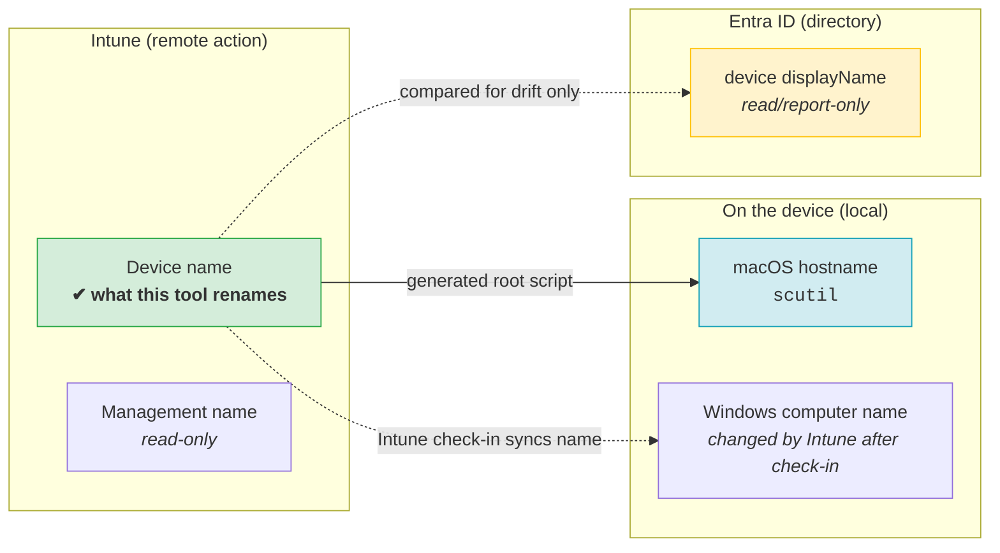
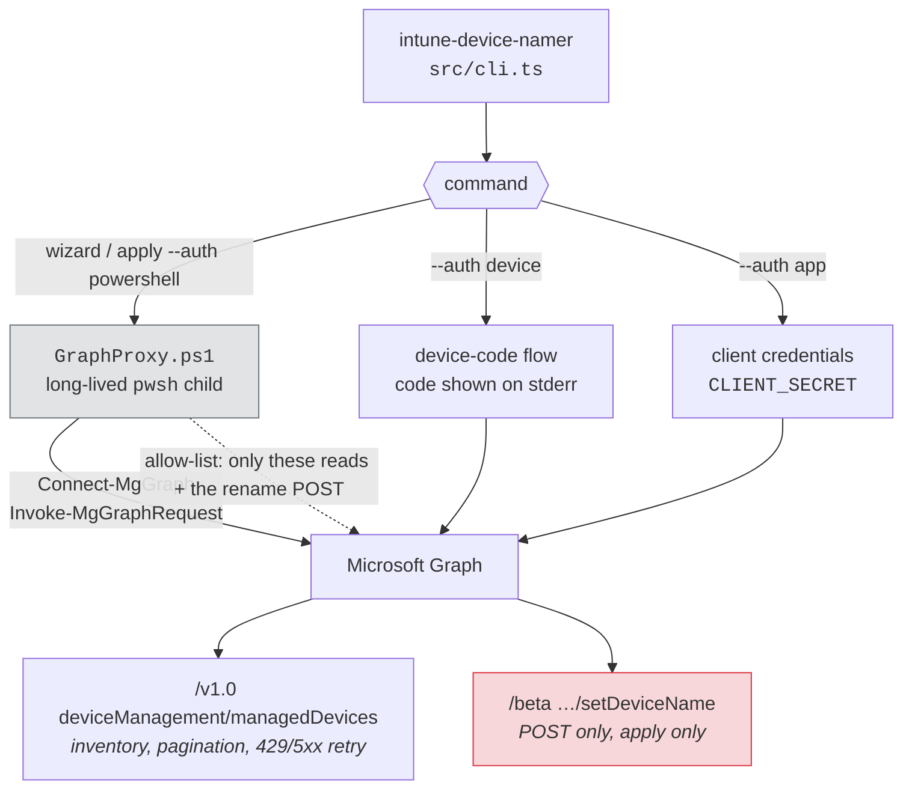
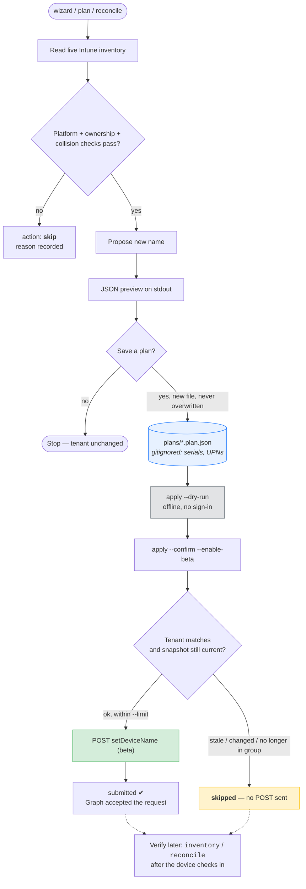

# intune-device-namer

[](https://github.com/RohiRIK/intune-device-namer/actions/workflows/ci.yml)
[](https://bun.sh)
[](https://learn.microsoft.com/powershell/scripting/overview)
[](LICENSE)
[](https://learn.microsoft.com/graph/api/intune-devices-manageddevice-list)

Bun-only TypeScript CLI for **previewing and reconciling Intune device names**, with platform filters, predefined/custom templates, optional assigned-username naming, and Entra name-drift reporting. It does **not** change Entra device display names. Run `bun run src/cli.ts --help` for every option.

## Features at a glance

| Feature | What it does |
|---|---|
| Interactive wizard | Signs in through PowerShell Graph, offers a searchable one-device picker, searchable Entra security group, or a fleet platform filter; shows example names and a dry-run plan. |
| Templates | Platform, serial, company, assigned Intune username, the first two letters of the assigned user's Entra department, and custom combinations; checks length, characters and collisions. |
| Saved plans | Stores the proposed rename(s) in JSON for review; `--dry-run` reads a saved plan offline. Saving a plan makes no tenant changes. |
| Guarded apply | Requires `--confirm --enable-beta` (or the wizard's final Confirm choice), re-reads each device, and reports `submitted`, `skipped`, or `failed` per device. |
| Automation | Scriptable JSON inventory/planning/reconciliation with app or device-code auth; macOS root shell-script generator for local hostnames. |

## How it works

The Graph rename action updates Intune's **Device name**. It does not create an enrollment policy, change Intune's Management name, or directly rename Entra's device display name. Four different names, three different places — this is the single most important thing to understand before running anything:



**Three sign-in paths, one CLI.** The wizard borrows your existing PowerShell Graph session; scripts can run unattended with an app registration.



**Plan first, apply deliberately.** Nothing in this tool renames a device by accident — a preview is a file on disk, and a write needs a file, a revalidation pass, and two explicit flags.



Guards that stand between a plan and a rename: `--enable-beta` (the action is Graph **beta** only), `--confirm`, a saved plan, a matching tenant, a default `--limit 10`, and a live re-read of every device. If the assigned user, department, serial, name, platform, ownership or group membership changed since the plan was written, that device is **skipped — no request is sent**.

## Start

Requires Bun 1.3+, an Intune-licensed tenant, and Microsoft Graph access. The wizard and `apply --auth powershell` require PowerShell 7 (`pwsh`) and `Microsoft.Graph.Authentication`. Direct Bun device-code/app-only commands require your own app registration. From this directory:

```sh
bun install
bun run typecheck
bun run src/cli.ts templates | jq .
bun run src/cli.ts validate --platform macOS --serial C02ABC123456 --template company-platform-serial --company ACME
sh ./Invoke-IntuneDeviceNamer.sh  # wizard: PowerShell interactive sign-in, preview only
```

For scriptable `--auth app` or `--auth device` commands, copy `.env.example` to `.env` and configure `TENANT_ID` and `CLIENT_ID` (plus `CLIENT_SECRET` for app mode). No `.env` is needed for the PowerShell-interactive wizard or `apply --auth powershell`.

New here? Read [How it works](#how-it-works) first — it explains which of the four device names this tool actually changes, and the guards between a preview and a real rename. For the shortest path, see [QUICKSTART.md](QUICKSTART.md).

### Interactive wizard (including PowerShell)

The `wizard` command uses **Clack** for interactive menus. It connects to Microsoft Graph automatically through PowerShell using `Connect-MgGraph -Scopes ... -NoWelcome`—there is no authentication-method question, tenant/client ID prompt, or app registration requirement in the wizard. A persistent local PowerShell proxy uses `Invoke-MgGraphRequest` for the wizard's Graph calls, reuses the session, checks the granted scopes, and requests the privileged scope only if you confirm an apply. Choose all devices, search one Intune device by name/serial/platform, **or search an Entra security group**. For a group, only its direct Entra *device* members that also appear in Intune inventory are included; a platform filter can narrow the group further. User members are not treated as their devices. The wizard detects a selected single device's platform without asking for an ID. Then choose a predefined format with visible example names, a custom pattern, or an exact name for one device. It displays a read-only preview of proposed changes and can save the plan to a **new** file. At the save prompt, pressing Enter creates `plans/pilot.plan.json` in this project; if it already exists, the wizard chooses `plans/pilot-2.plan.json`, `plans/pilot-3.plan.json`, etc. Explicit filenames are never overwritten. Applying is offered only when launched with `--enable-beta` and a plan was saved. The final choice shows the eligible rename count and offers **Cancel** (selected by default) or **Confirm**; Cancel keeps the plan without changing devices. Prompts go to stderr and the final preview/results are JSON on stdout. The PowerShell Graph session lives for this wizard run and closes on exit. Use `plan` rather than `wizard` in pipelines and unattended jobs.

The wizard reads the tenant's organization `displayName` from Microsoft Graph (the PowerShell equivalent is `Get-MgOrganization`, **not** `Get-MgContact`) and suggests a 12-character maximum uppercase alphanumeric company code. You can edit that suggestion. If the organization lookup is unavailable, you can still enter a code yourself when the chosen template includes `{company}`.

```powershell
# In PowerShell, from this directory (Bun must be on PATH):
.\Invoke-IntuneDeviceNamer.ps1
# To offer a guarded apply after preview and saving a plan:
.\Invoke-IntuneDeviceNamer.ps1 -CliArguments @('--enable-beta')
# PowerShell launcher also supports ordinary commands:
.\Invoke-IntuneDeviceNamer.ps1 -Command validate -CliArguments @('--platform', 'macOS', '--serial', 'C02ABC123456')
```

On macOS/Linux, invoke the shell launcher from any directory:

```sh
sh /path/to/intune-device-namer/Invoke-IntuneDeviceNamer.sh                 # guided preview
sh /path/to/intune-device-namer/Invoke-IntuneDeviceNamer.sh --enable-beta   # offer guarded apply
sh /path/to/intune-device-namer/Invoke-IntuneDeviceNamer.sh templates       # JSON list of presets
sh /path/to/intune-device-namer/Invoke-IntuneDeviceNamer.sh validate --platform macOS --serial C02ABC123456
```

Both launchers run Bun from their own directory to load its local `.env`; neither changes the caller's working directory. The wizard requires an interactive terminal. The implementation still runs in Bun.

Bun loads a local `.env` at runtime for direct-auth commands; a secure scheduler can supply environment variables instead. `.env` and saved files in `plans/` are gitignored. Plans contain serials, device IDs and potentially assigned UPNs; protect and review them. Plan files are created with restrictive permissions and are **never overwritten**. A bare filename passed to `--out` writes into this project's `plans/` folder; a bare `--plan-file` reads there. Existing plans saved in the project root by older versions can still be read by bare name. An absolute path or path containing `/`/`\` is used as given (relative paths resolve from the launcher's project directory). All command data goes to JSON stdout (help/version are human text); prompts and errors go to stderr. Exit status 0 means success; exit 1 means an error or any skipped/failed action during apply. No implicit tenant writes.

## Naming formats

| Built-in | Expansion example | Note |
|---|---|---|
| `platform-serial` | `MAC-C02ABC123456` | Default; full serial |
| `company-platform-serial` | `ACME-MAC-C02ABC123456` | Requires `--company ACME` |
| `compact-serial` | `MAC-BC123456` | Last eight serial characters; collision checks required |
| `platform-username-serial` | `MAC-ALEX-SMITH-C02ABC123456` | Uses assigned Intune user UPN; skips unassigned devices |
| `company-platform-username-serial` | `ACME-MAC-ALEX-SMITH-C02ABC123456` | Combines company, assigned username, and serial |
| `department-platform-username-serial` | `FI-MAC-ALEX-SMITH-C02ABC123456` | Uses **FI** from user department **Finance** instead of company; requires an assigned user |
| Custom | `HQ-MAC-C02ABC123456` | `--template 'HQ-{platform}-{serial}'` |

Or pass a custom pattern, such as `--template '{company}-{platform}-{username}-{serial}'`. **All available placeholders are displayed directly above the wizard's Custom input:**

| Placeholder | Example expansion | Source |
|---|---|---|
| `{platform}` | `MAC` | Device OS (`MAC`, `WIN`, `IOS`, `AND`) |
| `{serial}` | `C02ABC123456` | Intune hardware serial number |
| `{serial8}` | `BC123456` | Last eight characters of serial |
| `{company}` | `ACME` | Editable company code; wizard suggests one from Entra organization |
| `{username}` | `ALEX-SMITH` | Assigned Intune `userPrincipalName` local part, e.g. `alex.smith@contoso.com` |
| `{department}` | `FI` | First two usable letters of the assigned user's Entra `department`, e.g. `Finance` |

The username is normalized to uppercase letters, digits and hyphens (`.`/`_`/`+` become `-`); it is **not** the current logged-in user or a local macOS account. `{department}` reads the *assigned user's* Entra profile (`GET /users/{userId}?$select=department`) and takes the first two letters after removing punctuation/accents: `Finance` → `FI`, `Human Resources` → `HU`. It does **not** use the tenant organization name or the device's enrollment profile. Devices without a usable assigned UPN, assigned user ID, or two-letter department are skipped as appropriate. A permission error reading a user's department stops planning rather than silently assuming an empty department. If the assignment or full department value changes after planning, apply skips and asks for a fresh plan. Usernames and departments may change when a device is reassigned; use serial for uniqueness, especially in fleet templates. Literal text may contain letters, numbers and hyphens. Expanded names must be 1–63 characters, contain a letter, and not start/end with a hyphen. Missing/invalid identifiers, duplicate proposed names and names already held by another inventoried device cause skips. Names, departments and UPNs in JSON/plans are sensitive inventory data; restrict access to saved plans.

Offline example: `bun run src/cli.ts validate --platform macOS --serial C02ABC123456 --username alex.smith@contoso.com --template platform-username-serial`.
Department example: `bun run src/cli.ts validate --platform macOS --serial C02ABC123456 --username alex.smith@contoso.com --department Finance --template department-platform-username-serial` → `FI-MAC-ALEX-SMITH-C02ABC123456`.

For one device you can use an exact name, for example `--device-id <Intune-managed-device-GUID> --name MAC-FINANCE-01`. An exact name is intended only for a single device; do not use a constant template across an entire fleet.

## Authentication and permissions

| Mode | Configuration | How it works |
|---|---|---|
| Wizard PowerShell interactive (automatic) | `pwsh`, `Microsoft.Graph.Authentication`; no app ID required | Uses `Connect-MgGraph` in a long-lived child PowerShell session and `Invoke-MgGraphRequest`. Reads with `DeviceManagementManagedDevices.Read.All`, `Device.Read.All`, `User.Read`, `User.Read.All` (departments), and `Group.Read.All` (group selection/membership). After explicit apply confirmation, additionally requests `DeviceManagementManagedDevices.PrivilegedOperations.All`. The signed-in account also needs Intune RBAC `Remote tasks/Set device name` to rename. |
| Saved plan `apply --auth powershell` | Same PowerShell prerequisites | Connects interactively, verifies the signed-in tenant against the saved plan, then submits only eligible actions after `--confirm --enable-beta` and live revalidation. No app registration or `.env` needed. |
| `--auth device` (default) | `TENANT_ID`, `CLIENT_ID`; enable public-client device-code flow on the app | Displays a code on stderr; human signs in. Consent to delegated `DeviceManagementManagedDevices.Read.All`, `Device.Read.All`, `User.Read`, `User.Read.All`, and `Group.Read.All` for group-scoped plans; for apply, additionally `DeviceManagementManagedDevices.PrivilegedOperations.All` and Intune RBAC `Remote tasks/Set device name` with device visibility. |
| `--auth app` | Same IDs plus `CLIENT_SECRET`; securely inject environment variables | Client credentials, admin consent to **application** `DeviceManagementManagedDevices.Read.All` and `Device.Read.All`; add `Group.Read.All` for group plans, `User.Read.All` for department templates and `Organization.Read.All` for the wizard's company suggestion; additionally `DeviceManagementManagedDevices.PrivilegedOperations.All` for apply. No user-interactive step. Rotate the secret; prefer a managed secret store. |

App-only authentication does not bypass Intune action/platform constraints. For least privilege use a read-only app for inventory/planning and a separate write app for apply. This implementation targets the global Microsoft Graph cloud. A tenant's scope tags/RBAC visibility may restrict delegated results. Graph may throttle; the CLI honors `Retry-After` and retries transient 429/5xx responses. Microsoft Graph **beta** is required for the documented `setDeviceName` action: `--enable-beta` is mandatory for apply, and beta behavior can change.

## Commands and safe rollout

| Command | Output / effect |
|---|---|
| `templates` | Print preset patterns as JSON; no Graph connection. |
| `validate` | Expand a sample name offline from `--platform`, `--serial`, optional `--company` and `--username`. |
| `inventory` | Read Intune managed devices and compare Entra names; optionally filter by `--platform` or one `--device-id`. |
| `plan` | Read live inventory, generate a JSON preview, and optionally save it with `--out`. |
| `plan --group-id <GUID>` | Preview only direct device members of a selected Entra security group; saves group ID and name in the plan. |
| `reconcile` | Same read-only preview as `plan`; useful in scheduled reviews. |
| `wizard` | PowerShell interactive sign-in, device picker/platform filter, example names, plan preview and optional guarded apply. |
| `apply` | With `--dry-run`, print a saved plan offline; with `--confirm --enable-beta`, authenticate and submit eligible Intune rename actions after rechecking each device. |
| `generate-macos-script` | Create an idempotent root-run shell script to set macOS local names; the script is not uploaded automatically. |

```sh
bun run src/cli.ts inventory --platform Android --auth app | jq '.[] | {id, deviceName, entraName}'
bun run src/cli.ts reconcile --platform macOS --auth app | jq '.items[] | select(.action == "rename")'
bun run src/cli.ts plan --platform macOS --auth app --out pilot.plan.json | jq '.items | group_by(.action) | map({action: .[0].action, count: length})'
# Scripted group scope: paste the group object ID; wizard offers a searchable picker instead.
bun run src/cli.ts plan --group-id '<Entra-security-group-GUID>' --platform macOS --auth app --out group.plan.json | jq '.items[] | {currentName, proposedName, action}'
bun run src/cli.ts apply --auth app --plan-file pilot.plan.json --confirm --enable-beta --limit 5 | jq '.results[]'
# Reuse a saved one-device wizard plan with interactive PowerShell sign-in (in this directory):
sh ./Invoke-IntuneDeviceNamer.sh apply --plan-file pilot-4.plan.json --auth powershell --confirm --enable-beta --limit 1
# Target exactly one existing managed device; no write until the separate apply step:
bun run src/cli.ts plan --device-id '<Intune-managed-device-GUID>' --name MAC-FINANCE-01 --out single.plan.json | jq '.items[0]'
bun run src/cli.ts apply --plan-file single.plan.json --dry-run | jq '.plan.items[0]'
sh ./Invoke-IntuneDeviceNamer.sh apply --plan-file single.plan.json --auth powershell --confirm --enable-beta --limit 1
```

**Meaning of the result:** `plans/pilot.plan.json` is just the default saved proposal filename, not an Intune enrollment policy. For one selected device, press Enter at the filename prompt to save it; a later run picks `plans/pilot-2.plan.json`, then the next available number. A real apply submits a Graph beta rename action; `results[].status: "submitted"` means Microsoft Graph accepted the request, not that check-in has completed. `skipped` means **no rename request was sent for that device**; read its specific `reason` (for example, a changed assigned user or a conflicting name). A no-profile value of `null`, `""`, or whitespace is treated as equivalent during iOS revalidation. The wizard returns `not-submitted` if none were submitted and `partial` if only some were submitted. A saved plan can be re-applied only when the device still matches its snapshot; otherwise create a fresh plan.

`plan` and `reconcile` read the same live inventory; `reconcile` always previews. Plan output includes the source name and serial, desired name, support reason, enrollment profile name, Entra display name (if matched), and Entra drift; user-based plans also snapshot the assigned UPN and user ID, and department plans snapshot the full Entra department. `apply` refuses a tenant mismatch, requires a saved plan and explicit flags, limits the batch to 10 by default, re-fetches the device and Entra trust type, and skips if name, serial, assigned user, department, platform, ownership or eligibility have changed. It also rechecks iOS/iPadOS enrollment profiles because their naming templates can restore a name at check-in; **a changed macOS enrollment-profile label does not block an otherwise valid Intune rename**. A Graph `204` means the remote action was **submitted**, not that the local device or Entra record has already updated. Run a later inventory/plan to verify check-in. Repeated runs skip already-matching names. If a bulk action partly fails, exit 1 and inspect the JSON results. Scope pilots using `--platform` and `--device-id`; there is no group filter in this release.
`--device-id` is available only to scripted `inventory`, `plan`, `reconcile`, and `apply` calls. **The wizard uses a searchable list instead.** For a targeted scripted plan, the platform is read from the device even if another `--platform` is supplied. The saved plan records the detected platform. `apply --dry-run --plan-file ...` checks the saved plan's shape and, when configured, `TENANT_ID` locally, then prints proposed actions without Graph sign-in or a rename; it does not revalidate live device state. An apply with `--device-id` rejects plans targeting additional devices.

### Group scope

The wizard's **Entra device group** choice searches security groups by display name; scripted `plan`/`reconcile` accept `--group-id <GUID>`. Graph lists the group's **direct** members (including dynamic device-group members once Entra has evaluated them). It matches Entra device **object IDs** from membership to Intune `azureADDeviceId` through directory `deviceId`. Unmanaged devices, users, and devices without a matching directory record are excluded, not renamed. A saved group plan records the selected group ID/name and its matched Intune devices. Applying it re-reads the group's device membership and skips any device no longer a direct member; it does not automatically add newly joined devices to the saved plan. Generate a fresh plan to include them. Group reads require `Group.Read.All`; a failed or inaccessible group lookup stops planning/apply instead of broadening scope.

The wizard previews the group count before offering a plan. A group with no matching Intune-managed devices produces an empty preview and cannot submit a rename. Fleet applies still have a default `--limit 10` for the scripted command; raise it deliberately when the reviewed plan contains more than ten eligible renames. Dynamic membership can lag until Entra finishes evaluating the rule. Nested groups are **not expanded**.

For unattended operation, schedule `plan --auth app --out <new-unique-plan-file>` and have an operator or reviewed job apply that plan with `--confirm --enable-beta`. Use a fresh output filename on each run and retain only the runs you need for audit. The `reconcile` command is intentionally preview-only; a scheduler calling it does not rename new devices. Avoid overlapping apply jobs, and review the plan's scope before raising `--limit`. A failed/ambiguous remote POST is not retried because it may already have been submitted.

### Platform capability and existing-device impact

| Platform | Eligible Intune device name action | Local name / Company Portal / Entra impact |
|---|---|---|
| macOS | Corporate-owned Intune managed Macs, whether enrolled through ADE or manually | Rename action concerns the Intune Device name; use the generated root script below to set macOS `ComputerName`, `LocalHostName`, and `HostName`. Entra name is read/report-only. |
| Windows | Corporate-owned, **not hybrid-joined** Windows devices | Intune remote rename may affect local Windows name after check-in/restart. Hybrid join must be handled through domain processes and is skipped when directory trustType identifies it. Entra is read/report-only. |
| iOS/iPadOS | Supervised corporate devices | Existing ADE device-name template can restore its template name at the next check-in; devices with a named enrollment profile are skipped unless explicitly overridden with `--allow-ios-profile` at both planning and apply. This is a conservative proxy: inspect the policy before overriding. Entra is report-only. |
| Android Enterprise | Corporate-owned fully managed, dedicated or corporate-owned work profile, **when mode is identifiable** | Intune inventory name changes; device-local Android name does not. Unknown enrollment modes are skipped. Entra is report-only. |

The remote rename action changes Intune **Device name**, not Intune **Management name** or the Company Portal name. It does not provide universal local-hostname or Entra renaming. Personal/BYOD devices and unsupported enrollment modes are skipped. A new naming rule alone changes **no existing devices**: review a plan, apply it, then wait for check-in; use periodic reconciliation for later enrollments. For iOS/iPadOS ADE, the enrollment-policy template (`{{DEVICETYPE}}-{{SERIAL}}` is Microsoft's example, max 63 including variables) applies at enrollment and subsequent check-ins. Edit that policy in the Intune portal for a policy-managed convention rather than fighting it with repeated remote actions. The current Microsoft macOS ADE setup guide does not document an equivalent device-name-template control.

### New devices without Autopilot / ADE

Windows Autopilot is **not required** for inventory and post-enrollment Intune rename. Use your organization's normal supported enrollment method, wait for a managed-device record and check-in, then run `plan`/`apply` on a schedule. This does not enforce a name **before** enrollment. For Mac devices without ADE, manually enroll in Intune, deploy the generated script to a scoped device group, and periodically reconcile the Intune name. Neither this CLI nor a naming template blocks enrollment if a new device has a different name. If pre-enrollment Windows hostnames are mandatory, include a local rename in your provisioning process before domain join/registration; do not rely on Graph remote actions for that phase.

## macOS local automation

```sh
bun run src/cli.ts generate-macos-script --template company-platform-serial --company ACME --out mac-rename.sh
/bin/sh -n mac-rename.sh
```

Upload the generated script in Intune **Devices > By platform > macOS > Manage devices > Scripts**; configure **Run script as signed-in user: No (root)**, select a script frequency for ongoing reconciliation, and assign to a small device group first. The script reads the hardware serial via `ioreg`, refuses invalid/short identifiers and unsafe names, then idempotently sets all three macOS naming properties using `scutil`. Changing hostnames can affect DNS, remote access and other services that use the previous hostname; test a pilot. It cannot update Intune or Entra directly; the CLI remote action handles Intune separately. Intune's macOS agent must be installed; Microsoft documents macOS 12+ for shell scripts and agent check-in delays (often about eight hours). Script upload/assignment is a portal step; generating the artifact does not modify the tenant.
The script generator rejects `{username}` and `{department}` because a local root script cannot read Intune's assigned UPN or Entra department without a separate trusted source; those templates are available for Intune remote rename plans instead.

## Limitations and troubleshooting

- No supported general app-only Graph update of non-Windows Entra device `displayName`; reports show drift rather than claiming convergence. macOS local names and Entra names may differ permanently.
- Android's Graph `deviceEnrollmentType` strings differ among enrollment paths. Unknown or generic `androidEnterprise` modes intentionally skip; the CLI cannot safely infer corporate fully managed/dedicated/work-profile mode from ownership alone. Use the Intune admin center's platform-specific bulk rename for a mode the CLI cannot identify.
- `--allow-ios-profile` bypasses a conservative skip; an ADE template can still overwrite an ad-hoc rename at the next check-in.
- A partial plan only detects collisions among fetched devices and other currently named Intune devices; validate organizational DNS/asset uniqueness separately.
- Graph inventory calls are paginated and can be large. If `403`, verify Graph consent, active Intune license and Intune RBAC; for `401`, inspect app credentials or delegated sign-in. For `429`, retry after the service's delay.
- `Enrollment profile changed since preview` applies to iOS/iPadOS, whose ADE naming template can overwrite a rename. The CLI reads but never creates or updates an enrollment profile. macOS does not use that label as an apply guard; empty string/null/whitespace all mean "no profile" for iOS comparison.
- `submitted` means Graph accepted the remote action. Verify the new Intune Device name after check-in; Entra display name, Intune Management name, and local macOS hostnames are separate.
- No live-tenant integration test ships with this project: unit tests verify rendering, eligibility, collisions and plan behavior without credentials.

## Development

```sh
bun install
bun run typecheck   # tsc --noEmit
bun test            # 38 tests, no tenant credentials or live Graph calls needed
bun run build       # bundles to dist/
```

The test suite is fully offline: Graph is mocked, and the one PowerShell test shells out to a local `pwsh` and is skipped-worthy on machines without it. `pwsh` is not required for `typecheck` or `build`. See `tasks/todo.md` for the implementation history and open items.

## Safety notes before you point this at a real fleet

- **Nothing renames a device by accident.** `inventory`, `plan`, `reconcile` and the wizard only read. Writing needs a saved plan plus `--confirm --enable-beta`.
- **Test with one device first.** `plan --device-id <GUID> --name MAC-FINANCE-01` → `apply --dry-run` → `apply --confirm --enable-beta --limit 1`.
- **`--limit` defaults to 10.** Raise it deliberately, after reading the plan.
- **Plans contain sensitive inventory** (serials, device IDs, assigned UPNs, Entra departments). They are gitignored; treat them like an asset register.
- **A naming rule changes no existing devices.** New enrollments are only affected after enrollment, check-in, and a plan/apply cycle.
- **Verify with `reconcile` later**, not with the apply result. `submitted` means Graph accepted the request; the local device and Entra record update separately.

## Sources

- [Intune rename action: platform support, device-name scope, iOS template reversion](https://learn.microsoft.com/en-us/intune/device-management/actions/rename)
- [Graph beta setDeviceName action and privileged permission](https://learn.microsoft.com/en-us/graph/api/intune-devices-manageddevice-setdevicename?view=graph-rest-beta)
- [Graph v1 managedDevice list](https://learn.microsoft.com/en-us/graph/api/intune-devices-manageddevice-list?view=graph-rest-1.0)
- [Entra update restrictions on non-Windows app-only devices](https://learn.microsoft.com/en-us/graph/api/device-update?view=graph-rest-1.0)
- [iOS/iPadOS ADE device name template and check-in](https://learn.microsoft.com/en-us/intune/device-enrollment/apple/setup-automated-ios)
- [macOS ADE enrollment setup](https://learn.microsoft.com/en-us/intune/device-enrollment/apple/setup-automated-macos)
- [macOS Intune shell scripts and prerequisites](https://learn.microsoft.com/en-us/intune/device-management/tools/run-shell-scripts-macos)
- [Microsoft Graph get user (`department` requires `$select`)](https://learn.microsoft.com/en-us/graph/api/user-get?view=graph-rest-1.0)

## License

[MIT](LICENSE) © Rohi Rikman. Not an official Microsoft product; it calls documented Graph and Intune endpoints against your own tenant.
